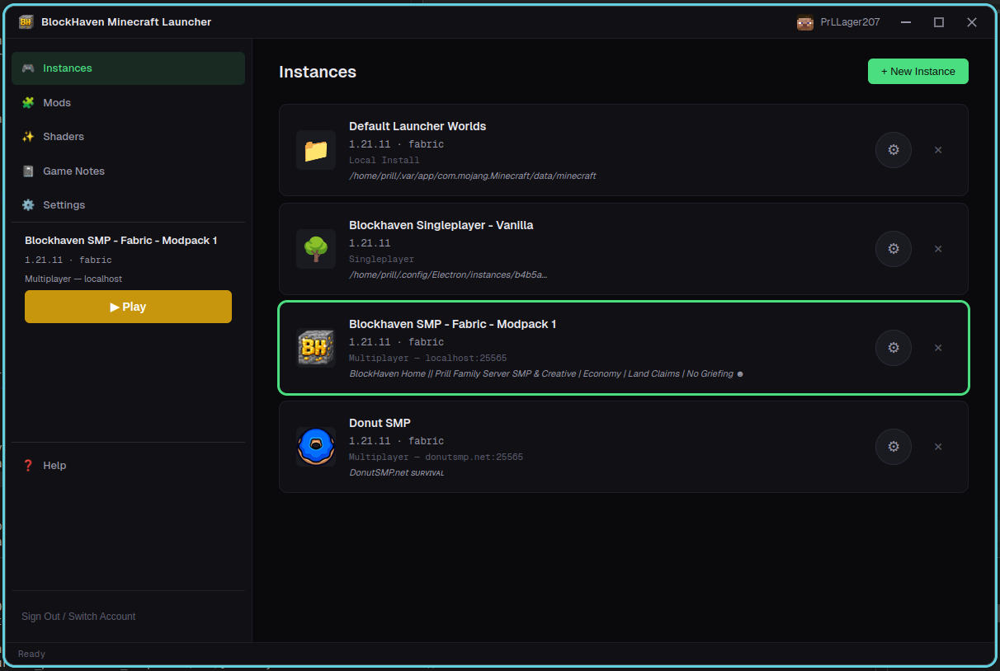

# BlockHaven Launcher

A free, open-source Minecraft launcher built with Electron, React, and TypeScript. Features Microsoft authentication, multi-instance game management, Modrinth mod browsing, and auto-connect to your own servers.



**[Download the latest release](https://github.com/prillcode/bh-minecraft-launcher/releases/latest)** · **[Sponsor this project](https://github.com/sponsors/prillcode)**

## Architecture

```
src/
├── core/           # Platform-agnostic business logic (no Electron imports)
│   ├── auth/       # MS OAuth → Xbox Live → XSTS → Minecraft token chain
│   ├── game/       # Version manifest, asset downloads, Java detection, launch
│   ├── mods/       # Modrinth API client, Fabric/Forge installer stubs
│   └── utils/      # Downloads, hashing, logging, OS paths
├── main/           # Electron main process, IPC handlers, preload bridge
└── renderer/       # React UI (Vite-bundled), Zustand stores, components
```

The `core/` layer is intentionally decoupled from Electron — it could be reused in a CLI launcher or tested without spinning up a browser window.

## Prerequisites

- **Node.js** >= 20
- **pnpm** >= 9
- **Java** 17+ (for actually running Minecraft)
- **Azure AD App Registration** (for Microsoft OAuth — see below)

## Quick Start

```bash
# Install dependencies
pnpm install

# Set your Azure AD client ID (see "Auth Setup" below)
export MS_CLIENT_ID="your-azure-app-client-id"

# Run in dev mode (hot-reload renderer + watch main process)
pnpm dev

# In a separate terminal, start Electron pointing at the dev server
pnpm start
```

## Auth Setup

Minecraft uses Microsoft accounts, so you need an Azure AD app registration:

1. Go to [Azure Portal → App Registrations](https://portal.azure.com/#blade/Microsoft_AAD_RegisteredApps/ApplicationsListBlade)
2. Click **New registration**
   - Name: `BlockHaven Launcher` (or whatever you like)
   - Supported account types: **Personal Microsoft accounts only**
   - Redirect URI: Select **Mobile and desktop applications** → `https://login.microsoftonline.com/common/oauth2/nativeclient`
3. After creation, copy the **Application (client) ID**
4. Under **API permissions**, ensure `XboxLive.signin` is listed (it should be by default for personal account apps)
5. Under **Authentication**, enable **Allow public client flows** (required for device-code flow)

Set the client ID as an environment variable or replace the placeholder in `src/core/auth/microsoft.ts`.

## Scripts

| Command | Description |
|---|---|
| `pnpm dev:all` | Start everything — TS watch + Vite dev + Electron (recommended) |
| `pnpm dev` | Start Vite dev server + TypeScript watch for main process |
| `pnpm start` | Launch Electron (run after `dev` or `build`) |
| `pnpm build` | Production build (main + renderer) |
| `pnpm package` | Package distributable via electron-builder |
| `pnpm test` | Run tests with Vitest |
| `pnpm lint` | Lint with ESLint |

## Key Design Decisions

- **Device-code auth flow** — User gets a short code, opens any browser to sign in. No embedded browser auth (which Microsoft is deprecating), no redirect URI headaches.
- **Instance isolation** — Each game profile gets its own directory (saves, mods, configs). No cross-contamination between vanilla and modded setups.
- **Parallel asset downloads** — Uses `p-queue` with concurrency of 8 and SHA1 verification on every file. Skips already-downloaded assets automatically.
- **Server auto-connect** — Instances can be configured with a `serverAutoConnect` host/port so launching drops you straight into your server.
- **Frameless window** — Custom title bar for a cleaner look, with standard minimize/maximize/close wired through IPC.

## TODO

- [ ] Implement conditional argument resolution in launch.ts (rule-based JVM/game args)
- [ ] Skin rendering on the account screen
- [ ] Auto-updater via electron-updater
- [ ] Tests for auth chain (mock the HTTP calls) and launch arg assembly

## Tech Stack

- **Electron 34** — Desktop shell
- **React 19** + **Vite 6** — Renderer UI
- **Zustand** — State management
- **@azure/msal-node** — Microsoft OAuth
- **got** — HTTP client for Mojang/Xbox APIs and asset downloads
- **p-queue** — Concurrency-limited parallel downloads
- **electron-store** — Encrypted credential persistence
- **winston** — Structured logging
- **Tailwind CSS 4** — Styling
- **Vitest** — Testing

## License

MIT — AP Dev Solutions LLC
